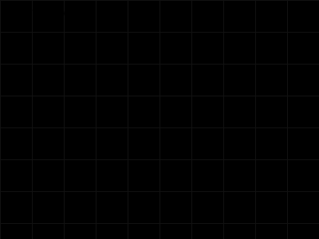
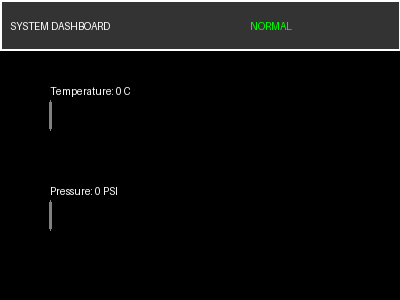
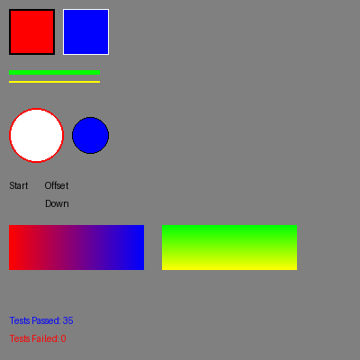

# EGL: Embedded Graphics Language v1.7

EGL is a compact, Turing-complete graphics language designed for serial communication between microcontrollers (like Arduino) and host computers. It enables low-bandwidth devices to drive high-performance, interactive visual displays.

## Key Features
- **Compact Syntax:** Single-letter or two-letter commands for minimal serial overhead.
- **Turing-Complete:** Supports variables, functions, recursion, loops, and conditional logic.
- **High-Level Primitives:** Sprite blitting, tilemaps, gradients, and advanced text rendering.
- **Double Buffering:** Smooth animations via `FB()` (Flip Buffer) and `FR()` (Frame Rate) control.
- **Interactivity:** Integrated event system with hit zones and polling-based input (`KS`, `KP`).
- **Color Palettes:** Support for 256-color palettes for memory-efficient effects.

## Quick Start
Run the interpreter on any `.egl` script:
```bash
python3 egl_interpreter.py demo_game.egl --output game_result.png
```

## Visual Gallery
EGL's versatility and performance can be seen in these automatically generated results:

### Interactive Game Simulation (`demo_game.egl`)
Displays sprites, double-buffering, and real-time score tracking.


### Telemetry Dashboard (`demo_dashboard.egl`)
Showcases vector gauges, dynamic text, and nested UI containers.


### Progressive Refinement (`progressive_cube_test.py`)
Simulates low-bandwidth 3D sprite updates using an LFSR-sequenced `LD` (Load Data) command.


### Stress & Recursion Test (`stress_test.egl`)
Verifies deep recursion (Ackermann) and high-volume rendering of 1000+ primitives.


### Comprehensive Validation (`comprehensive_test.egl`)
Automated suite verifying all v1.7 logical assertions.


## Documentation
- [EGL Specification v1.7](EGL_spec.md) - Full command reference.
- [Bandwidth Analysis](Bandwidth_Analysis.md) - Performance comparison vs. ReGiS and Raw Pixel data.

## Mock Ecosystem
The project includes a mock Arduino environment for testing serial protocols without hardware:
- `mock_arduino_base.py`: The simulation core.
- `mock_game_host.py`: A full game engine simulation.
- `arduino_game.ino`: Example C++ code for the microcontroller side.

## Testing
A comprehensive test suite is available:
```bash
python3 egl_interpreter.py comprehensive_test.egl --output comprehensive_output.png
```
This suite verifies math, logic, strings, arrays, collisions, and event callbacks.
